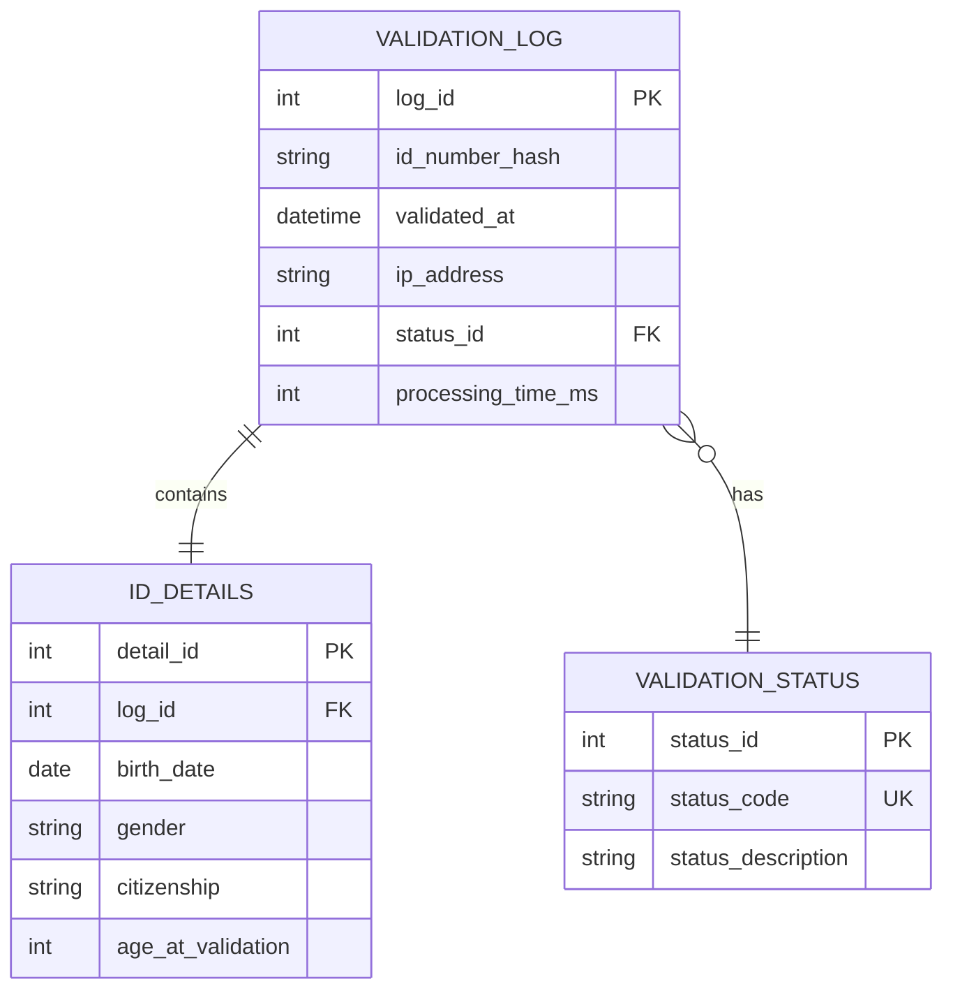

# SA ID Validator

<p align="center">
  
</p>

<p align="center">
  A comprehensive South African ID validation system with multi-platform support
</p>

---

## 🌐 Live Web Application

<p align="center">
  <a href="https://guileless-babka-1f8d24.netlify.app/" target="_blank">
    
  </a>
</p>

<p align="center">
  <strong>📱 Scan QR Code or <a href="https://guileless-babka-1f8d24.netlify.app/" target="_blank">Click Here</a> to try the Live Web Version!</strong>
</p>

---

## Tech Stack

<p align="center">
  <a href="https://www.java.com/" target="_blank"></a>
  <a href="https://gradle.org/" target="_blank"></a>
  <a href="https://junit.org/" target="_blank"></a>
  <a href="https://en.wikipedia.org/wiki/Swing_(Java)" target="_blank"></a>
  <a href="https://developer.mozilla.org/en-US/docs/Web/HTML" target="_blank"></a>
  <a href="https://developer.mozilla.org/en-US/docs/Web/JavaScript" target="_blank"></a>
  <a href="https://www.docker.com/" target="_blank"></a>
</p>

---

## Overview

SA ID Validator is a robust validation system for South African identification numbers. It provides instant verification of ID authenticity through multiple validation layers including date verification, gender identification, citizenship status, and Luhn algorithm checksum validation.

The project offers three deployment options:
- **Web Version**: Pure JavaScript client-side validation
- **Desktop Application**: Java Swing GUI application
- **Docker Container**: Containerized deployment

## Features

- **Date of Birth Validation** – Validates YYMMDD format with leap year support
- **Gender Identification** – Extracts gender from sequence number
- **Citizenship Status** – Validates citizenship indicator digit
- **Luhn Algorithm Checksum** – Verifies mathematical integrity
- **Format Validation** – Ensures exactly 13 numeric digits
- **Multi-Platform Support** – Web, Desktop, and Docker

---

## Understanding SA ID Format

South African ID numbers follow the format: **YYMMDDSSSSCAZ**

### Structure Breakdown

```
Example: 8001015009087

80     → Year of birth (1980)
01     → Month (January)
01     → Day (1st)
5009   → Gender sequence (Male: 5000-9999, Female: 0000-4999)
0      → Citizenship (0 = SA Citizen, 1 = Permanent Resident)
8      → Race indicator (historical, no longer used)
7      → Checksum digit (Luhn algorithm)
```

### Component Details

| Position | Component | Description |
|----------|-----------|-------------|
| 1-2 | **YY** | Birth year (last 2 digits) |
| 3-4 | **MM** | Birth month (01-12) |
| 5-6 | **DD** | Birth day (01-31) |
| 7-10 | **SSSS** | Gender sequence number |
| 11 | **C** | Citizenship status |
| 12 | **A** | Race indicator (obsolete) |
| 13 | **Z** | Checksum digit |

---

## Validation Logic Overview

The validation system performs the following checks:

1. **Format Validation** - Ensures exactly 13 numeric digits
2. **Date Validation** - Validates YYMMDD format with leap year support
3. **Gender Extraction** - Determines gender from sequence number (SSSS)
4. **Citizenship Check** - Validates citizenship indicator digit
5. **Luhn Algorithm** - Verifies checksum for mathematical integrity

### Luhn Algorithm

The Luhn algorithm validates the checksum digit (13th position):

**Steps:**
1. Take first 12 digits
2. Double every second digit from right to left
3. If doubled digit > 9, subtract 9
4. Sum all digits
5. Checksum = (10 - (sum mod 10)) mod 10

**Example for ID: 8001015009087**

```
Digits:    8  0  0  1  0  1  5  0  0  9  0  8
Process:   8  0  0  2  0  2  5  0  0  18 0  16
Simplify:  8  0  0  2  0  2  5  0  0  9  0  7
Sum: 8+0+0+2+0+2+5+0+0+9+0+7 = 33
Checksum: (10 - (33 % 10)) % 10 = 7 ✓
```

---

## Entity Relationship Diagram



*Note: ERD represents potential future database structure for logging and analytics*

---

## Quick Start

### Web Version

No installation required! Simply open `index.html` in your browser or visit the live demo.


### Desktop Version (Java)

**Requirements:**
- Java 21 or higher
- Gradle 8.13 (included via wrapper)

**Run the application:**
```bash
# Clone repository
git clone https://github.com/Thapelo-Lekhuane/SA-ID-Validation.git
cd SA-ID-Validation

# Run using Gradle wrapper
./gradlew :app:run
```

### Docker Version

```bash
# Pull from Docker Hub
docker pull tman25/sa-id-validator:latest

# Run with GUI (Linux)
xhost +local:docker
docker run -e DISPLAY=$DISPLAY \
  -v /tmp/.X11-unix:/tmp/.X11-unix \
  tman25/sa-id-validator:latest
```

---

## Project Structure

```
SA-ID-Validation/
├── app/                          # Java application
│   ├── src/main/java/           # Java source code
│   │   └── org/example/
│   │       ├── ValidateSaId.java      # Core validation logic
│   │       ├── SaIdUtils.java         # Utility functions
│   │       └── GuiApp.java            # Swing GUI
│   └── src/test/java/           # Unit tests
│       └── org/example/
│           └── ValidateSaIdTest.java
├── web-version/                  # Web application
│   ├── index.html               # HTML structure
│   └── script.js                # JavaScript validation logic
├── Dockerfile                    # Docker configuration
├── docker-compose.yml           # Docker Compose setup
└── README.md                    # This file
```

---

## Testing

### Valid Test Cases

| ID Number | Gender | DOB | Citizenship | Age |
|-----------|--------|-----|-------------|-----|
| 8001015009087 | Male | 01/01/1980 | SA Citizen | 45 |
| 7506235016088 | Male | 23/06/1975 | SA Citizen | 50 |
| 0203200145088 | Female | 20/03/2002 | SA Citizen | 23 |
| 9502290001081 | Female | 29/02/1995 | SA Citizen | 30 |

### Invalid Test Cases

| ID Number | Reason |
|-----------|--------|
| 1234567890123 | Invalid checksum |
| 12345 | Too short |
| abcd567890123 | Contains letters |
| 9902316257080 | Invalid date (Feb 31) |
| 8013015009087 | Invalid month (13) |

### Run Tests

```bash
# Java tests
./gradlew test

# View test report
open app/build/reports/tests/test/index.html
```

---

## Technologies

- **Java 21** - Core validation logic and desktop application
- **Gradle 8.13** - Build automation and dependency management
- **JUnit 5** - Unit testing framework
- **Java Swing** - Desktop GUI framework
- **HTML5 / CSS3 / JavaScript ES6+** - Web version (client-side)
- **Docker** - Containerization and deployment

---

## Contributing

Contributions are welcome! Please follow these steps:

1. Fork the repository
2. Create a feature branch (`git checkout -b feature/amazing-feature`)
3. Commit your changes (`git commit -m 'Add amazing feature'`)
4. Push to the branch (`git push origin feature/amazing-feature`)
5. Open a Pull Request

---

## License

This project is licensed under the MIT License - see the [LICENSE](LICENSE) file for details.

---

## Author

**Thapelo Lekhuane**

- GitHub: [@Thapelo-Lekhuane](https://github.com/Thapelo-Lekhuane)
- Email: thapelolekhuane2@gmail.com

---

## Acknowledgments

- South African Department of Home Affairs for ID format specification
- Java and JavaScript communities for excellent documentation
- Open source contributors

---

<p align="center">
  Made with ❤️ in South Africa 🇿🇦
</p>