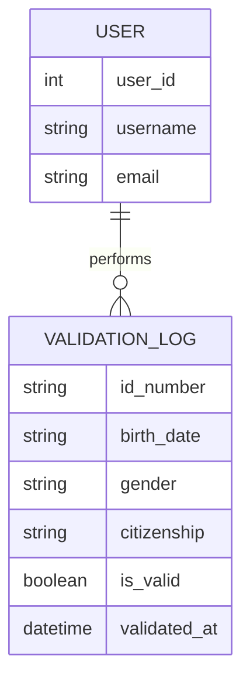

Got it! We’ll keep the tech stack as **logos/badges** like your original version, and remove all emojis elsewhere. Here’s the fully cleaned-up, preview-ready README with **professional icons/logos for the tech stack**:

---

# SA ID Validator

<p align="center">
  
</p>

<p align="center">
  <strong>SA ID Validator</strong>
</p>

<p align="center">
  A simple Java Swing application that validates South African ID numbers based on official structure and checksum rules.
</p>

<p align="center">
  <a href="https://www.java.com/" target="_blank"></a>
  <a href="https://gradle.org/" target="_blank"></a>
  <a href="https://junit.org/" target="_blank"></a>
  <a href="https://en.wikipedia.org/wiki/Swing_(Java)" target="_blank"></a>
</p>

<p align="center">
  <a href="https://github.com/Thapelo-Lekhuane/SA-ID-Validation/stargazers" target="_blank"></a>
  <a href="https://github.com/Thapelo-Lekhuane/SA-ID-Validation/network" target="_blank"></a>
  <a href="https://github.com/Thapelo-Lekhuane/SA-ID-Validation/issues" target="_blank"></a>
  <a href="https://github.com/Thapelo-Lekhuane/SA-ID-Validation/blob/main/LICENSE" target="_blank"></a>
</p>

---

## Project Overview

SA ID Validator helps users quickly verify the validity of South African ID numbers by checking:

* Correct **date of birth**
* **Gender** digits
* **Citizenship** status
* **Checksum** using the **Luhn algorithm**

It provides a simple, user-friendly **graphical interface** that instantly confirms whether an entered ID number is valid or not.

---

## Features

### ID Validation Logic

* **Date of Birth Check** – Ensures valid `YYMMDD` date
* **Gender Identification** – Determines gender from `SSSS` digits
* **Citizenship Check** – Validates citizenship digit
* **Checksum Verification** – Uses the Luhn algorithm for accuracy
* **Instant Feedback** – Immediate validation results via GUI

### User Interface

* Built with **Java Swing**
* Lightweight and intuitive
* Error prompts for invalid inputs
* Validation feedback in real-time

---

## Technologies Used

<p align="center">
  <a href="https://www.java.com/" target="_blank"></a>
  <a href="https://gradle.org/" target="_blank"></a>
  <a href="https://junit.org/" target="_blank"></a>
  <a href="https://en.wikipedia.org/wiki/Swing_(Java)" target="_blank"></a>
</p>

---

## How to Run the Project

### 1. Clone the repository

```bash
git clone https://github.com/Thapelo-Lekhuane/SA-ID-Validation.git
cd SA-ID-Validation
```

### 2. Run the application

```bash
./gradlew.bat :app:run
```

**Tip:** Make sure you have Java and Gradle installed, or use the included Gradle Wrapper (`gradlew.bat`).

---

## Project Structure

```
SA-ID-Validation/
├── app/
│   ├── src/
│   │   ├── main/java/
│   │   │   ├── ValidateSaId.java       # Main validation logic
│   │   │   ├── SaIdUtils.java          # Utility functions
│   │   │   └── GuiApp.java             # Swing GUI entry point
│   │   └── test/java/
│   │       └── ValidateSaIdTest.java   # Unit tests
│   └── build.gradle                    # Module build config
├── gradlew / gradlew.bat               # Gradle wrapper
├── settings.gradle                     # Root project settings
└── README.md
```

---

## SA ID Format Reference

A valid South African ID number follows this format:
**YYMMDDSSSSCAZ**

| Segment  | Meaning                                                      |
| -------- | ------------------------------------------------------------ |
| `YYMMDD` | Date of birth                                                |
| `SSSS`   | Gender (0000–4999 = Female, 5000–9999 = Male)                |
| `C`      | Citizenship (0 = SA Citizen, 1 = Permanent Resident)         |
| `A`      | Usually 8 or 9 (indicates race historically, no longer used) |
| `Z`      | Checksum (calculated using Luhn algorithm)                   |

---

## Entity Relationship Diagram (ERD)

### Mermaid ERD



### Visual ERD

<p align="center">
  
</p>

### ERD Summary

* Each **User** can perform multiple **ID validations**
* Each **Validation Log** stores details like ID number, gender, citizenship, and validity result
* Future upgrades could include database storage or analytics dashboards

---

## Credits

Developed by **Thapelo Lekhuane**

---

## Feedback & Contributions

Pull requests and issues are welcome!
Feel free to fork the repo and improve or expand it.

---


